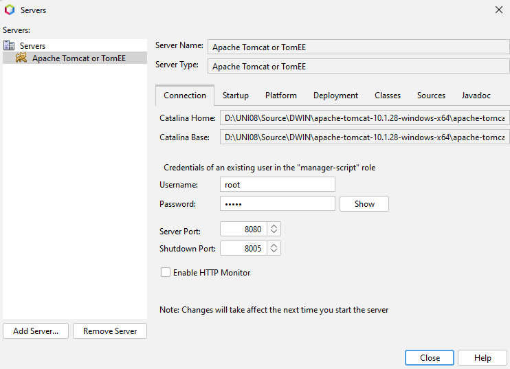

# Documentación Técnica del Proyecto - Solo Boticas


[TOC]

## Introducción

### Descripción general del proyecto

El proyecto consiste en el desarrollo de un sistema de gestión de ventas e inventario para una farmacia. Este sistema incluye una intranet donde se gestionarán las ventas, el registro de compradores y vendedores, y la administración de productos mediante una base de datos relacional. El sistema está diseñado para ser accesible tanto para los empleados de la farmacia, quienes podrán registrar productos y gestionar ventas, como para los compradores, que podrán registrarse, iniciar sesión y realizar compras en línea.

El proyecto se desarrollará utilizando tecnologías web como JSP (Java Server Pages), MySQL para la base de datos, y un servidor Tomcat para gestionar las peticiones del lado del servidor. El diseño de la interfaz se manejará con CSS para darle estilo y JavaScript para agregar interactividad y dinamismo a la página. La integración de MySQL se realiza a través de XAMPP, que permite el manejo del servidor de base de datos de manera eficiente.

### Objetivo del sistema

El objetivo principal del sistema es ofrecer una solución centralizada para la gestión de inventarios y ventas en una farmacia, asegurando la integridad de los datos y facilitando el flujo de trabajo entre los empleados y los clientes. Con este sistema, se pretende automatizar tareas críticas como el registro de productos, la actualización del inventario y la realización de órdenes de compra. Asimismo, se permitirá a los vendedores y compradores interactuar a través de una plataforma amigable y segura, optimizando así la eficiencia operativa y mejorando la experiencia del usuario.

### Tecnologías utilizadas

#### MySQL

MySQL es el sistema de gestión de bases de datos relacional utilizado para almacenar y gestionar toda la información relacionada con los usuarios (compradores y vendedores), productos, inventario y órdenes de compra. Su flexibilidad y rendimiento permiten manejar grandes volúmenes de datos, y mediante el uso de triggers y procedimientos almacenados, se asegura la consistencia de las operaciones.

#### Tomcat

Tomcat es el servidor web utilizado para ejecutar las aplicaciones Java y JSP. Actúa como intermediario entre el usuario y la base de datos, procesando las peticiones del lado del servidor y sirviendo las páginas dinámicas al navegador. Tomcat permite la ejecución de servlets y el manejo eficiente de sesiones, garantizando la seguridad y funcionalidad de la plataforma.

#### JSP

JSP (Java Server Pages) es el lenguaje principal para incrustar código Java dentro del HTML, lo que permite crear contenido dinámico en función de las interacciones del usuario. Mediante JSP, el sistema puede realizar consultas a la base de datos MySQL y generar respuestas personalizadas, como la visualización de productos, el registro de usuarios y la realización de compras.

#### CSS y JavaScript

CSS se utiliza para definir el estilo y la apariencia de las páginas web, garantizando una experiencia de usuario coherente y visualmente atractiva. JavaScript añade dinamismo a la interfaz, permitiendo interacciones como la validación de formularios, la actualización de elementos en tiempo real y la mejora de la experiencia general del usuario.

#### XAMPP

XAMPP es una plataforma que incluye un servidor Apache, una base de datos MySQL y herramientas para el desarrollo web. En este proyecto, XAMPP facilita la gestión del servidor de base de datos MySQL y su integración con Tomcat, permitiendo que el sistema funcione de manera fluida en un entorno local. XAMPP es ideal para entornos de desarrollo, ya que proporciona un fácil acceso a los recursos necesarios para ejecutar y probar la aplicación.

## Estructura del Proyecto

### Arquitectura del sistema

El sistema sigue una arquitectura basada en tres capas principales: la capa de presentación (interfaz web), la capa de lógica de negocio (procesamiento de datos y operaciones) y la capa de datos (base de datos MySQL). La integración de estas capas permite un flujo de información eficiente y seguro, garantizando la funcionalidad tanto para los usuarios externos (compradores) como para los internos (vendedores y administradores).

#### Integración de base de datos MySQL

La base de datos MySQL es el corazón del sistema, gestionando la información de productos, usuarios, inventario y órdenes. Se han creado varias tablas interrelacionadas para organizar los datos de manera coherente y eficiente. Además, se han implementado triggers y procedimientos almacenados para automatizar ciertas tareas, como la actualización del inventario tras cada venta y la recuperación de información de pedidos específicos.

```mysql
CREATE SCHEMA sb_db;

USE sb_db;

CREATE TABLE cliente (
  uid varchar(20) NOT NULL,
  pass varchar(20) DEFAULT NULL,
  fname varchar(15) DEFAULT NULL,
  lname varchar(15) DEFAULT NULL,
  email varchar(30) DEFAULT NULL,
  address varchar(128) DEFAULT NULL,
  phno bigint DEFAULT NULL,
  PRIMARY KEY (uid)
);

CREATE TABLE vendedor (
  sid varchar(15) NOT NULL,
  sname varchar(20) DEFAULT NULL,
  pass varchar(20) DEFAULT NULL,
  address varchar(128) DEFAULT NULL,
  phno bigint DEFAULT NULL,
  PRIMARY KEY (sid)
);

CREATE TABLE producto (
  pid varchar(15) NOT NULL,
  pname varchar(20) DEFAULT NULL,
  manufacturer varchar(20) DEFAULT NULL,
  mfg date DEFAULT NULL,
  exp date DEFAULT NULL,
  price int DEFAULT NULL,
  PRIMARY KEY (pid),
  UNIQUE KEY pname (pname)
);

CREATE TABLE inventario (
  pid varchar(15) NOT NULL,
  pname varchar(20) DEFAULT NULL,
  quantity int unsigned DEFAULT NULL,
  sid varchar(15) NOT NULL,
  PRIMARY KEY (pid,sid),
  CONSTRAINT fk01 FOREIGN KEY (pid) REFERENCES product (pid) ON DELETE CASCADE,
  CONSTRAINT fk02 FOREIGN KEY (pname) REFERENCES product (pname) ON DELETE CASCADE,
  CONSTRAINT fk03 FOREIGN KEY (sid) REFERENCES seller (sid) ON DELETE CASCADE
);

CREATE TABLE ordenes (
 oid int NOT NULL AUTO_INCREMENT,
 pid varchar(15) DEFAULT NULL,
 sid varchar(15) DEFAULT NULL,
 uid varchar(15) DEFAULT NULL,
 orderdatetime datetime DEFAULT NULL,
 quantity int unsigned DEFAULT NULL,
 price int unsigned DEFAULT NULL,
 PRIMARY KEY (oid),
 CONSTRAINT fk04 FOREIGN KEY (pid) REFERENCES product (pid) ON DELETE CASCADE,
 CONSTRAINT fk05 FOREIGN KEY (sid) REFERENCES seller (sid) ON DELETE CASCADE,
 CONSTRAINT fk06 FOREIGN KEY (uid) REFERENCES customer (uid) ON DELETE CASCADE
);

ALTER TABLE orders AUTO_INCREMENT=1000;
```

#### Servidor Tomcat y JSP

El servidor Tomcat actúa como el intermediario entre los usuarios y el sistema de backend. Utilizando JSP (Java Server Pages), se generan dinámicamente páginas web en función de las interacciones del usuario. Tomcat permite el procesamiento de solicitudes HTTP, manteniendo la lógica de la aplicación separada de la presentación de la misma.



#### Interfaz web dinámica con CSS y JavaScript

La interfaz del sistema está diseñada para ser intuitiva y atractiva, utilizando CSS para definir los estilos y el diseño de la página. JavaScript añade interactividad, permitiendo una experiencia de usuario fluida mediante la validación de formularios, la manipulación de elementos dinámicos y el uso de AJAX para la actualización de datos sin recargar la página. Este enfoque mejora la experiencia del usuario al reducir el tiempo de respuesta y aumentar la interactividad.

### Descripción de los módulos principales

#### Módulo de ventas

Este módulo gestiona todo lo relacionado con la venta de productos. Los compradores pueden navegar por el inventario, seleccionar productos y realizar pedidos. El sistema calcula automáticamente los precios en función de las cantidades seleccionadas, y se registra cada venta en la base de datos, actualizando el inventario en tiempo real mediante triggers.

#### Módulo de gestión de usuarios (compradores y vendedores)

El sistema permite el registro y la gestión tanto de compradores como de vendedores. Los compradores pueden crear cuentas para realizar pedidos, mientras que los vendedores pueden gestionar los productos que venden y revisar sus órdenes a través de la intranet. Cada usuario tiene credenciales únicas para acceder al sistema de manera segura.

#### Intranet (gestión interna de productos)

La intranet está diseñada para los empleados y administradores de la farmacia. Aquí, los vendedores pueden agregar nuevos productos al inventario, actualizar información existente y monitorear el estado de las órdenes. También se pueden generar informes sobre las ventas y la disponibilidad de productos.

#### Ventanas básicas (Nosotros, Contacto, etc.)

El sistema también incluye ventanas básicas accesibles desde la interfaz pública, como las secciones de "Nosotros" y "Contacto", que proporcionan información general sobre la empresa y permiten la comunicación con los administradores del sistema. Estas ventanas están diseñadas de manera estática, pero con un estilo coherente con el resto del sistema.

## Diseño de la Base de Datos

### Estructura de la base de datos

El diseño de la base de datos sigue una estructura relacional que garantiza la integridad de los datos y facilita la interacción entre las diferentes entidades del sistema. Todas las tablas están organizadas dentro del esquema `sb_db`, que gestiona la información de compradores, vendedores, productos, inventario y órdenes.

#### Esquema `sb_db`

El esquema `sb_db` agrupa todas las tablas relacionadas con las operaciones del sistema. Se han implementado diversas restricciones y claves foráneas para garantizar la coherencia y evitar inconsistencias en los datos. Además, las claves primarias aseguran que cada registro sea único y fácilmente accesible.

#### Descripción de las tablas

##### Tabla `comprador`

La tabla `cliente` almacena la información de los compradores registrados en el sistema. Incluye campos como `uid` (identificador único del comprador), nombre, dirección, correo electrónico, número de teléfono, entre otros. El campo `uid` es la clave primaria que garantiza la unicidad de cada comprador.

##### Tabla `vendedor`

La tabla `vendedor` gestiona la información de los vendedores. Contiene el identificador único del vendedor (`sid`), nombre, dirección, número de teléfono y la contraseña para acceder al sistema. La clave primaria es el campo `sid`, que asegura que cada vendedor esté identificado de manera única.

##### Tabla `productos`

La tabla `productos` organiza la información de los productos disponibles en el sistema. Cada producto tiene un identificador único (`pid`), nombre, fabricante, fechas de fabricación y caducidad, y su precio. El campo `pid` es la clave primaria, mientras que el campo `pname` tiene una restricción de clave única para evitar duplicados en los nombres de los productos.

##### Tabla `inventario`

La tabla `inventario` mantiene el registro del inventario disponible para cada producto, relacionando los productos con los vendedores. Cada entrada en esta tabla está vinculada a un producto (`pid`) y un vendedor (`sid`), junto con la cantidad disponible. La clave primaria es una combinación de `pid` y `sid`, lo que permite identificar de manera única el inventario de un producto específico gestionado por un vendedor particular.

##### Tabla `ordenes`

La tabla `ordenes` registra todas las órdenes de compra realizadas por los compradores. Cada orden tiene un identificador único (`oid`), así como referencias a los productos (`pid`), vendedores (`sid`), y compradores (`uid`). También almacena la cantidad, el precio de la orden y la fecha y hora en que se realizó la compra. El campo `oid` es la clave primaria.

#### Relaciones y claves foráneas

Las relaciones entre las tablas están definidas mediante claves foráneas que aseguran la consistencia de los datos. Estas relaciones permiten conectar la información de productos, inventarios y órdenes de manera eficiente.

##### Relaciones entre `productos`, `inventario` y `ordenes`

**Producto e Inventario**: La tabla `inventario` contiene claves foráneas que hacen referencia a la tabla `producto`, vinculando cada producto a su correspondiente registro de inventario.

**Órdenes y Productos/Vendedores/Compradores**: La tabla `ordenes` incluye claves foráneas que conectan cada orden con su producto, vendedor y comprador. Estas relaciones permiten rastrear el flujo completo de una transacción, desde el producto comprado hasta el vendedor y comprador involucrados.

##### Restricciones y claves primarias/foráneas

Las claves primarias, como `pid`, `sid`, y `uid`, aseguran la unicidad de los registros dentro de las tablas.

Las claves foráneas, como `fk01`, `fk02`, y `fk04`, mantienen la integridad referencial entre las tablas, evitando que se eliminen o modifiquen registros dependientes sin afectar la consistencia de los datos.

## Manejo de Eventos en la Base de Datos

El manejo de eventos en la base de datos se realiza mediante *triggers*, que permiten ejecutar acciones automáticas en respuesta a eventos específicos, como la inserción de nuevas órdenes o la modificación de registros en el inventario. A continuación se describen los principales *triggers* implementados en el sistema.

### Triggers en la base de datos

Los *triggers* son esenciales para mantener la coherencia y actualización automática de ciertos datos críticos en el sistema. En este caso, se han implementado *triggers* para gestionar la actualización automática de la fecha de creación de órdenes y para ajustar las cantidades de productos en el inventario tras cada compra.

#### `actualizartime`: Actualización automática de fechas en órdenes

El *trigger* `actualizartime` se activa antes de insertar una nueva orden en la tabla `orders`. Su función es establecer automáticamente la fecha y hora exacta en que se genera la orden, asegurando que siempre se registre el momento preciso de cada transacción sin necesidad de intervención manual.

```mysql
DELIMITER //
CREATE TRIGGER updatetime 
BEFORE INSERT ON orders 
FOR EACH ROW
BEGIN
    SET NEW.orderdatetime = NOW();
END//
DELIMITER ;
```

#### `inventariotrigger`: Actualización automática del inventario

El *trigger* `inventariotrigger` se activa después de que se inserta una nueva orden en la tabla `orders`. Su función es reducir automáticamente la cantidad de productos disponibles en el inventario en función de la cantidad de productos comprados en cada orden. De esta manera, el sistema asegura que el inventario siempre esté actualizado y refleje las cantidades correctas tras cada transacción.

```mysql
DELIMITER //
CREATE TRIGGER inventorytrigger 
AFTER INSERT ON orders
FOR EACH ROW
BEGIN
    DECLARE qnty int;
    DECLARE productid varchar(20);

    SELECT pid INTO productid
    FROM orders
    ORDER BY oid DESC
    LIMIT 1;

    SELECT quantity INTO qnty 
    FROM orders
    ORDER BY oid DESC
    LIMIT 1;

    UPDATE inventory
    SET quantity = quantity - qnty
    WHERE pid = productid;
END//
DELIMITER ;
```

Este *trigger* permite que el sistema de inventario se mantenga siempre sincronizado con las compras realizadas, evitando problemas como sobreventas o discrepancias entre el inventario real y el registrado.

## Implementación en el Servidor

La implementación del sistema en el servidor se basa en la configuración de Apache Tomcat como servidor de aplicaciones, permitiendo la ejecución de páginas JSP para la generación dinámica de contenido. A través de la integración con XAMPP, se maneja el servidor MySQL para gestionar las operaciones de la base de datos de manera eficiente.

### Configuración del servidor Tomcat

Apache Tomcat actúa como el servidor principal para la aplicación web, gestionando las peticiones HTTP y proporcionando soporte para la ejecución de código Java Server Pages (JSP). La conexión con la base de datos MySQL se gestiona a través de controladores JDBC, permitiendo el acceso y manipulación de los datos en tiempo real.

#### Conexión de JSP con la base de datos MySQL

Para conectar las páginas JSP con la base de datos MySQL, se utiliza JDBC (Java Database Connectivity), que permite la interacción directa con las tablas del esquema `sb_db`. A través de esta conexión, las operaciones como el registro de usuarios, la inserción de órdenes y la actualización del inventario son manejadas de manera eficiente.

```java
Class.forName("com.mysql.jdbc.Driver");
Connection con = DriverManager.getConnection(
    "jdbc:mysql://localhost:3306/sb_db", "user", "password");
```

#### Integración con XAMPP para manejo de MySQL

XAMPP proporciona el servidor MySQL, el cual es configurado y gestionado en conjunto con Tomcat. XAMPP facilita el desarrollo local al agrupar MySQL, Apache y PHP en un único entorno, permitiendo que MySQL maneje todas las operaciones de base de datos del sistema, mientras Tomcat procesa las solicitudes del servidor.

### Gestión de sesiones en JSP

La gestión de sesiones en JSP es fundamental para controlar el acceso de los usuarios a diferentes secciones de la plataforma, como la intranet y los módulos de ventas. A través de objetos de sesión en JSP, se almacenan y gestionan datos clave como los detalles de autenticación y los permisos de acceso.

#### Registro y autenticación de usuarios

El sistema de autenticación permite que tanto compradores como vendedores se registren y accedan a la plataforma. La información de cada usuario es validada contra los datos almacenados en la base de datos. Una vez autenticado, se crea una sesión que permite a los usuarios navegar por las diferentes secciones del sistema según sus roles.

```java
String uid = request.getParameter("uid");
String pass = request.getParameter("pass");
PreparedStatement ps = con.prepareStatement("SELECT * FROM customer WHERE uid=? AND pass=?");
ps.setString(1, uid);
ps.setString(2, pass);
ResultSet rs = ps.executeQuery();
if (rs.next()) {
    session.setAttribute("uid", uid);
    response.sendRedirect("intranet.jsp");
} else {
    response.sendRedirect("login.jsp");
}

```

#### Acceso a la intranet

Una vez autenticado, los usuarios autorizados pueden acceder a la intranet. Dentro de esta sección, se gestionan actividades internas como la actualización del inventario, la administración de productos, y la revisión de órdenes. La intranet ofrece una interfaz segura y accesible solo a usuarios registrados.

#### Manejo de roles (compradores vs vendedores)

El sistema distingue entre los roles de compradores y vendedores. Dependiendo del tipo de usuario autenticado, el acceso a ciertos módulos y funcionalidades será limitado. Por ejemplo, los vendedores pueden gestionar inventarios y productos, mientras que los compradores solo pueden realizar compras y revisar sus órdenes.

```java
String role = (String) session.getAttribute("role");
if (role.equals("seller")) {
    response.sendRedirect("seller_dashboard.jsp");
} else if (role.equals("buyer")) {
    response.sendRedirect("buyer_dashboard.jsp");
}
```

## Interfaz de Usuario

La interfaz de usuario del sistema se diseña para ofrecer una experiencia amigable, dinámica y adaptativa. Utilizando CSS para los estilos y JavaScript para la interactividad, se asegura que la interfaz sea atractiva y funcional en diferentes dispositivos, desde pantallas grandes hasta móviles.

### Diseño de la interfaz con CSS y JavaScript

El diseño del sistema combina una estructura limpia y profesional con elementos dinámicos para mejorar la experiencia del usuario. Se utilizan hojas de estilo en cascada (CSS) para darle una presentación consistente y atractiva, mientras que JavaScript añade funcionalidad interactiva.

#### Estilo de la página principal (Index)

La página principal, o índice, actúa como el punto de entrada a la aplicación. Incluye un menú de navegación lateral que da acceso a las ventanas secundarias como "Nosotros" y "Contacto", así como a la intranet para la gestión de productos y ventas. El diseño del índice utiliza un esquema de colores profesional y una estructura que facilita la navegación.

```css
body {
    font-family: Arial, sans-serif;
    background-color: #f4f4f4;
}

nav {
    width: 250px;
    height: 100vh;
    background-color: #333;
    color: white;
    position: fixed;
    padding: 20px;
}

nav a {
    color: white;
    text-decoration: none;
    display: block;
    margin: 10px 0;
}

```

#### Ventanas secundarias (Nosotros, Contacto)

Estas ventanas proporcionan información adicional sobre la empresa y permiten a los usuarios interactuar a través de formularios de contacto. El diseño es minimalista y enfocado en la accesibilidad. El uso de CSS garantiza que las páginas sean visualmente coherentes con el resto de la plataforma, mientras que JavaScript gestiona la validación de formularios y la interactividad.

### Interactividad con JavaScript

JavaScript se utiliza para añadir dinamismo a la interfaz, mejorando la usabilidad a través de validaciones, actualizaciones en tiempo real y una gestión más eficiente de los productos y las órdenes.

#### Validación de formularios

La validación de formularios es crucial para asegurar que los datos ingresados por los usuarios, como información de contacto o detalles de registro, sean correctos antes de enviarse a la base de datos. JavaScript valida los campos obligatorios y el formato de los datos, como correos electrónicos o números de teléfono.

```javascript
function validateForm() {
    var email = document.getElementById("email").value;
    var phone = document.getElementById("phone").value;
    
    if (email == "" || !email.includes("@")) {
        alert("Por favor, ingrese un correo válido.");
        return false;
    }
    if (isNaN(phone) || phone.length < 10) {
        alert("Por favor, ingrese un número de teléfono válido.");
        return false;
    }
    return true;
}
```

#### Dinamismo en la gestión de productos

Mediante el uso de JavaScript, los usuarios pueden gestionar los productos de forma más interactiva. Por ejemplo, es posible actualizar el inventario en tiempo real, mostrar detalles de productos al hacer clic, o agregar productos al carrito de compras sin recargar la página.

```javascript
function addToCart(productId) {
    var cart = document.getElementById("cart");
    var product = document.getElementById(productId).innerText;
    cart.innerHTML += "<li>" + product + "</li>";
}
```

### Responsividad y diseño adaptativo

Para garantizar que la interfaz sea accesible desde cualquier dispositivo, se implementa un diseño responsivo mediante CSS. Esto permite que el sistema se adapte automáticamente a diferentes tamaños de pantalla, asegurando que los usuarios puedan interactuar cómodamente desde sus teléfonos móviles, tabletas o computadoras de escritorio.

```css
@media only screen and (max-width: 600px) {
    nav {
        width: 100%;
        height: auto;
        position: relative;
    }
    
    nav a {
        float: left;
        padding: 15px;
    }
}
```

## Casos de Uso

Los casos de uso del sistema describen las principales interacciones que tienen los usuarios (compradores, vendedores y administradores) con el sistema. Estos flujos permiten gestionar compras, ventas, y productos de manera eficiente y automática.

### Registro de un nuevo comprador o vendedor

Los nuevos compradores y vendedores pueden registrarse a través de un formulario accesible desde la interfaz web. Los datos ingresados se almacenan en las tablas correspondientes de la base de datos (`cliente` y `vendedor`), y el sistema valida que no haya duplicados en los identificadores (UID o SID).

1. El usuario accede al formulario de registro.
2. Ingresan sus datos: nombre, apellido, dirección, correo electrónico, y número de teléfono.
3. El sistema valida la información y crea el nuevo perfil en la base de datos.

```mysql
INSERT INTO customer (uid, pass, fname, lname, email, address, phno) 
VALUES ('user123', 'password', 'Juan', 'Pérez', 'juanperez@gmail.com', 'Av. Ejemplo 123', 999888777);

```

### Realización de una compra

Los compradores pueden realizar compras seleccionando productos desde la interfaz web. El sistema genera un nuevo pedido en la tabla `orders`, actualiza automáticamente el inventario, y guarda los detalles de la transacción.

1. El comprador elige un producto de la lista disponible.
2. El sistema calcula el total según la cantidad seleccionada.
3. El pedido se registra en la tabla `orders` y se genera un número único para el mismo.

```mysql
INSERT INTO orders (pid, sid, uid, orderdatetime, quantity, price) 
VALUES ('prod001', 'seller123', 'user123', NOW(), 2, 500);

```

### Actualización automática de inventario

Después de que una compra se ha realizado, el sistema activa un trigger (`inventorytrigger`) que actualiza automáticamente el inventario, reduciendo la cantidad disponible del producto en cuestión.

1. Se realiza una compra en el sistema.
2. El trigger `inventorytrigger` se activa.
3. El inventario se actualiza en función de la cantidad comprada.

```mysql
UPDATE inventory
SET quantity = quantity - 2
WHERE pid = 'prod001';
```

### Visualización de pedidos (usuarios y vendedores)

Tanto compradores como vendedores pueden ver el historial de pedidos. Los compradores visualizan sus compras pasadas, mientras que los vendedores pueden revisar las órdenes recibidas. Estos datos se recuperan mediante procedimientos almacenados que filtran los pedidos por usuario o vendedor.

1. El comprador o vendedor accede a la sección "Mis Pedidos".
2. El sistema ejecuta los procedimientos almacenados `getorders` o `getsellerorders` según corresponda.
3. Se muestra una lista de pedidos con detalles como producto, cantidad, y fecha de compra.

```mysql
CALL getsellerorders('seller123');
```

### Gestión de productos en la intranet

Los administradores y vendedores pueden gestionar los productos a través de la intranet. Esto incluye agregar nuevos productos, modificar detalles de productos existentes, y controlar el inventario. Las acciones de modificación o inserción se reflejan en la base de datos mediante operaciones SQL.

1. El vendedor accede a la intranet para gestionar productos.
2. Pueden agregar nuevos productos o actualizar la información existente (nombre, precio, fabricante, etc.).
3. Los cambios se guardan en la base de datos.

```mysql
INSERT INTO product (pid, pname, manufacturer, mfg, exp, price) 
VALUES ('prod002', 'Producto Ejemplo', 'Fabrica S.A.', '2024-01-01', '2025-01-01', 100);
```

## Pruebas y Depuración

El proceso de pruebas y depuración es esencial para asegurar que el sistema funcione de manera correcta, eficiente y libre de errores. Este apartado detalla las diferentes pruebas realizadas y los mecanismos de depuración implementados durante el desarrollo del proyecto.

### Pruebas unitarias de la base de datos

Las pruebas unitarias se centraron en validar la correcta funcionalidad de cada consulta SQL, trigger y procedimiento almacenado. Estas pruebas verificaron que los datos fueran insertados, actualizados y eliminados correctamente en las tablas correspondientes sin causar inconsistencias.

- **Pruebas de inserción y actualización:** Se realizaron pruebas para asegurarse de que las inserciones en las tablas (`comprador`, `vendedor`, `producto`, etc.) se ejecutaran sin errores y que las restricciones de claves primarias y foráneas funcionaran como se esperaba.
- **Validación de triggers:** Se probó el correcto funcionamiento de los triggers `actualizartime` e `inventariotrigger` para garantizar que las fechas y cantidades se actualicen automáticamente.
- **Ejecución de procedimientos almacenados:** Los procedimientos `getorders` y `getsellerorders` fueron probados para verificar que devuelvan correctamente los resultados según los parámetros de entrada.

```mysql
INSERT INTO product (pid, pname, manufacturer, mfg, exp, price) 
VALUES ('test001', 'TestProduct', 'TestManu', '2024-01-01', '2025-01-01', 50);
```

### Pruebas funcionales de la interfaz

Las pruebas funcionales evaluaron el correcto comportamiento de la interfaz web en diferentes escenarios de usuario. Se probó la navegación por las distintas ventanas (Inicio, Nosotros, Contacto, etc.) y la interacción con los formularios de registro y compra.

- **Validación de formularios:** Se realizaron pruebas de validación para asegurarse de que los campos de los formularios (registro de usuario, compra de productos) acepten solo datos válidos y manejen adecuadamente errores de entrada.
- **Interactividad con JavaScript:** Se probó el dinamismo de la página en la actualización automática de productos y la validación en tiempo real de los formularios.

### Pruebas de integración entre servidor y base de datos

Las pruebas de integración evaluaron la correcta comunicación entre el servidor Tomcat, los scripts JSP y la base de datos MySQL. Se verificó que las operaciones CRUD (Create, Read, Update, Delete) en la interfaz se reflejaran adecuadamente en la base de datos.

- **Prueba de conexión:** Se comprobó que las conexiones a la base de datos fueran estables y rápidas, sin pérdidas de datos o caídas inesperadas.
- **Prueba de recuperación de datos:** Se evaluó la correcta visualización de datos en la interfaz (por ejemplo, listar productos o pedidos) y que estos datos se correspondieran con los almacenados en la base de datos.

### Manejo de errores y depuración

Durante el desarrollo, se implementaron estrategias de manejo de errores para evitar que el sistema colapse ante entradas inválidas o errores inesperados. La depuración se realizó utilizando varias herramientas:

- **Manejo de excepciones en JSP:** Se implementaron bloques `try-catch` en el código JSP para capturar y gestionar errores relacionados con la conexión a la base de datos y las operaciones SQL.
- **Mensajes de error personalizados:** Se incluyeron mensajes de error amigables para el usuario en caso de fallos en la autenticación o en el procesamiento de formularios.
- **Registros y logs de errores:** Se configuraron logs del servidor Tomcat para rastrear errores de conexión, fallos en la base de datos y otras excepciones del sistema.

```java
try {
    // Código de conexión a la base de datos
} catch (SQLException e) {
    System.out.println("Error en la conexión: " + e.getMessage());
}
```

## Conclusiones y Futuras Mejoras

En este apartado se resume el proyecto realizado y se discuten posibles mejoras que podrían implementarse en futuras versiones del sistema.

### Resumen del proyecto

El sistema desarrollado integra una base de datos MySQL con una interfaz web dinámica, gestionada a través de JSP y servida mediante Tomcat. Se logró automatizar y optimizar procesos clave, como la gestión de ventas, el registro de usuarios (compradores y vendedores), y el control de inventarios. Además, se implementaron triggers y procedimientos almacenados para mejorar la eficiencia en la gestión de pedidos y actualizar automáticamente el inventario. El uso de tecnologías como CSS y JavaScript permitió ofrecer una interfaz de usuario intuitiva y dinámica, con un diseño responsivo que se adapta a diferentes dispositivos.

### Posibles mejoras

A pesar de los logros alcanzados, el sistema presenta diversas áreas que pueden ser mejoradas o expandidas en futuras versiones para aumentar su funcionalidad y seguridad.

#### Implementación de un sistema de reportes

Una mejora significativa sería la adición de un sistema de reportes que permita a los administradores, vendedores y compradores generar informes personalizados. Estos reportes podrían incluir datos sobre ventas, productos más vendidos, inventarios críticos y comportamiento de los usuarios. La generación de reportes permitiría una mejor toma de decisiones y una mayor visibilidad sobre el rendimiento del sistema.

#### Mejora de la seguridad en la gestión de usuarios

Aunque el sistema incluye funcionalidades básicas de autenticación, es recomendable mejorar los mecanismos de seguridad, especialmente en la gestión de contraseñas y roles de usuario. La implementación de encriptación de contraseñas, autenticación de dos factores (2FA) y sesiones más seguras podrían minimizar riesgos relacionados con accesos no autorizados. Además, la segmentación más detallada de los roles de compradores y vendedores permitiría una gestión más controlada del acceso a los recursos del sistema.

#### Expansión a un sistema multi-sucursal

Una posible expansión futura del sistema sería permitir la gestión de múltiples sucursales dentro de la misma plataforma. Esto implicaría ajustar la base de datos para permitir la segmentación de inventarios y ventas por sucursal, así como la capacidad de gestionar vendedores y compradores asociados a ubicaciones específicas. Esta mejora sería esencial para escalar el sistema a un entorno corporativo con varias tiendas o puntos de venta.
